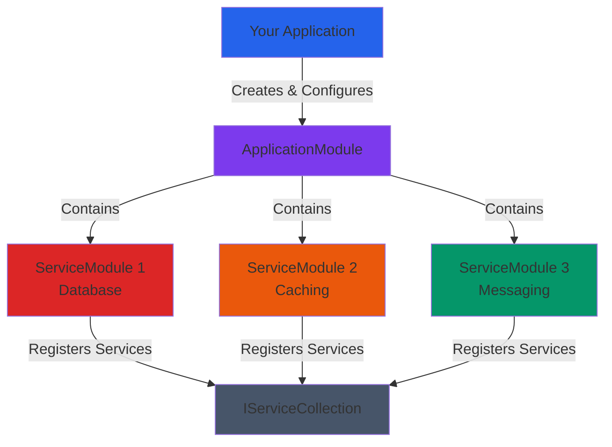

# AuroraScienceHub.Framework.Composition

A modular composition framework for .NET applications that provides structured service organization using application modules and service modules.

## Overview

Build applications using a modular architecture pattern. Organize dependency injection registration into logical, reusable modules that ensure services are registered only once.

## Key Features

- **Modular Architecture** - Organize services into logical, reusable modules
- **Single Registration Guarantee** - Ensures each module's services are registered only once
- **Assembly Discovery** - Automatically tracks assemblies associated with modules
- **Configuration Support** - Built-in IConfiguration integration
- **Extension Methods** - Helpful utilities for service registration

## Installation

```bash
dotnet add package AuroraScienceHub.Framework.Composition
```

## Architecture

The composition framework uses a hierarchical structure where Application Modules aggregate multiple Service Modules. Each Service Module encapsulates a cohesive set of service registrations and is guaranteed to be registered only once, preventing duplicate dependencies.



**Key Concepts:**

- **ApplicationModule** - Top-level module that composes multiple service modules and represents a complete application or subsystem
- **ServiceModule** - Self-contained unit that registers a cohesive set of related services (e.g., database, caching, messaging)
- **Single Registration** - Each service module maintains internal state to ensure its services are registered exactly once, even if referenced by multiple application modules

## Usage

### Create a Service Module

```csharp
public class DatabaseServiceModule : ServiceModuleBase
{
    protected override void ConfigureServicesInternal(
        IServiceCollection services,
        IConfiguration configuration)
    {
        services.AddDbContext<MyDbContext>();
        services.AddScoped<IRepository, Repository>();
    }
}
```

### Create an Application Module

```csharp
public class MyApplicationModule : ApplicationModuleBase
{
    public MyApplicationModule()
        : base("MyApp", new ServiceModuleBase[]
        {
            new DatabaseServiceModule(),
            new CachingServiceModule()
        })
    {
    }
}
```

### Register in Your Application

```csharp
var builder = WebApplication.CreateBuilder(args);
var module = new MyApplicationModule();
module.ConfigureServices(builder.Services, builder.Configuration);
```

## Helper Extensions

```csharp
// Register class with all implemented interfaces
services.AddScopedAsImplementedInterfaces<MyService>();

// Check if service is registered
if (services.ContainsService<IMyService>()) { }
```

## Module Options

```csharp
public class MyModuleOptions : ApplicationModuleOptionsBase
{
    public string ConnectionString { get; set; }
}

// appsettings.json
{
  "Modules": {
    "MyModule": {
      "ConnectionString": "...",
      "EnableConsumers": true
    }
  }
}
```

## Benefits

- **Maintainability** - Clear separation of concerns
- **Reusability** - Service modules can be shared across applications
- **Testability** - Easy to mock and test individual modules
- **Prevention of Duplicate Registration** - Built-in marker pattern

## Integration with ASP.NET Core

For web applications, see `AuroraScienceHub.Framework.AspNetCore` which extends this package with `IWebApplicationModule` and `WebApplicationModuleBase`.

## License

See [LICENSE](../../LICENSE) file in the repository root.

## Related Packages

- `AuroraScienceHub.Framework.AspNetCore` - ASP.NET Core extensions
- `AuroraScienceHub.Framework.Configuration` - Enhanced configuration support
